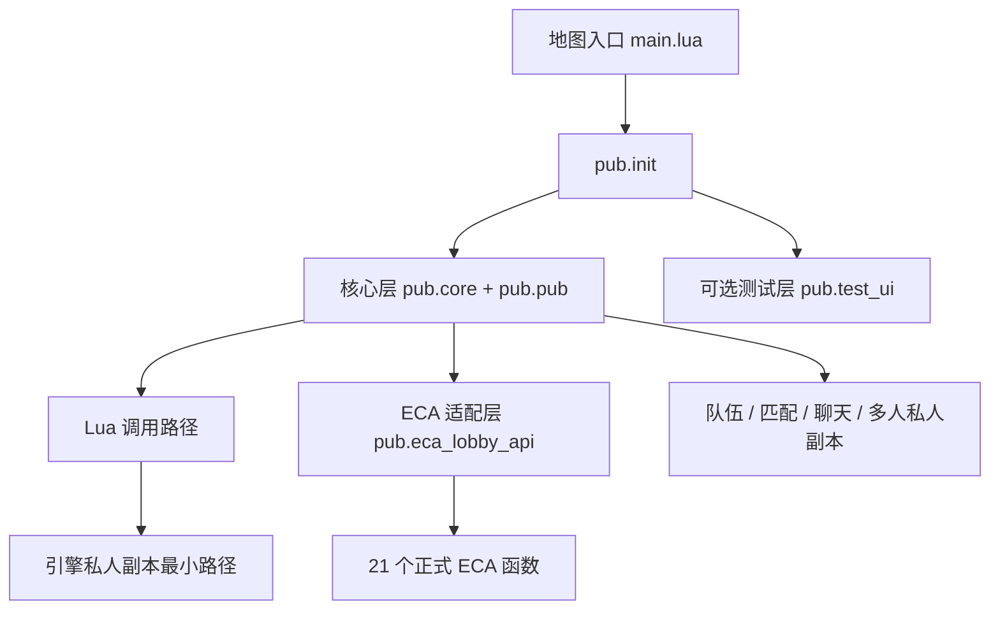

# 项目概览与功能依赖

[返回文档入口](./README.md)

## 系统做什么

当前项目把玩家进入地图后的大厅相关流程分成四类：

1. 连接与身份：创建大厅/副本上下文中的 `BOB` 客户端并等待就绪。
2. 社交与匹配：维护队伍、聊天、匹配和启动状态。
3. 副本切换：创建私人副本、启动多人私人副本、口令加入和返回大厅。
4. 生命周期：跨图后重建状态，退出前取消匹配、离队并清理服务端玩家状态。

当前大厅入口和副本入口都会加载 `pub.init`。`pub.init` 再按顺序加载完整核心、Lua 对外调用接口、ECA 适配层和可选测试 UI。本文将包装底层实现、供 Lua 或 ECA 直接调用的函数统一称为“对外调用接口”。

## 三层迁移模型

“三层”描述的是迁移时的责任边界，不是三个都必须复制的目录。

### 第一层：核心能力包

包含 `pub/core/`、`pub/pub.lua`、`pub/runtime_token.lua`、协议文件和运行配置。它负责大厅连接、身份、队伍状态、匹配、聊天、多人私人副本 RPC 和退出清理。

只要使用下列任一能力，就应整体迁移这一层：

- 队伍管理。
- 单人或组队匹配。
- 世界聊天或队伍聊天。
- 以当前队伍启动多人私人副本。
- 退出前服务端状态清理。

这些功能共享连接、玩家、队伍和请求状态。删除“暂时没调用”的核心文件可能在登录、通知或清理阶段造成隐蔽故障。

### 第二层：调用适配

调用适配决定业务代码如何使用核心：

- Lua 路径直接使用 `pub.pub` 暴露的对外调用接口和 `BOB` 公共方法。
- ECA 路径额外使用 `pub.eca_lobby_api`、21 个正式 ECA 函数和完成事件。

`pub.eca_lobby_api` 不是 `BOB` 核心的一部分。保留 ECA 路径时迁移；Lua-only 完整方案可以删除 `include 'pub.eca_lobby_api'` 并不复制该文件及 ECA 定义。

轻量私人副本也可以有 ECA 适配，但必须是为最小职责编写的轻量 ECA 对外调用接口，不能直接复制依赖完整 `BOB`、包含 21 个函数的完整对外调用接口。

### 第三层：界面与验证

`pub.test_ui` 是演示和验收层，不是运行核心。它提供按钮、输入框、状态显示和测试资源，便于验证功能闭环。

- 需要现成测试面板时保留 `pub.test_ui` 及其图片资源。
- 使用自己的正式 UI 时，删除 `include 'pub.test_ui'`，把按钮接到同一 Lua/ECA 接口。
- `pub/ui.lua` 当前没有由 `pub.init` 加载，不能把它当作默认核心依赖。

正式 UI 美术制作不在本文档范围内。

## 功能依赖矩阵

| 功能 | Lua 入口 | ECA 入口 | 完整 `BOB` | 轻量方案 | 关键限制 |
| --- | --- | --- | --- | --- | --- |
| 大厅连接 | `CreateBobInLobby` | `大厅服务 - 重建大厅连接` | 必需 | 不使用 | 使用核心服务时必须先就绪 |
| 副本上下文连接 | `CreateBobInGame` | 进入地图后由现有入口建立 | 必需 | 不使用 | 跨图后是新的 Lua 运行环境 |
| 创建/加入/离开队伍 | `MatchTestCreateTeam` 等 | 对应队伍函数 | 必需 | 不支持 | 匹配或启动中限制管理操作 |
| 转移队长/移出成员/解散 | 对应 `MatchTest*` 函数 | 对应队伍函数 | 必需 | 不支持 | 仅队长可执行 |
| 单人/组队匹配 | `MatchTestStart`、`MatchTestCancel` | 开始/取消匹配 | 必需 | 不支持 | 组队时由队长控制 |
| 世界聊天 | `BOB:send_world_chat` | `大厅服务 - 发送世界聊天` | 必需 | 不支持 | 连接必须就绪 |
| 队伍聊天 | `BOB:send_chat` | `大厅服务 - 发送队伍聊天` | 必需 | 不支持 | 必须在队伍中 |
| 引擎私人副本 | `MatchTestLocalPrivate` | 完整 ECA 对外调用接口中的创建函数，或轻量 ECA 对外调用接口 | 可选 | 支持 | 不依赖队伍；跨图后重查 |
| 获取/分享副本口令 | `MatchTestGetDungeonToken` | 获取副本口令 | 可选 | 支持 | 口令来自当前 `space_id` |
| 口令加入 | `MatchTestJoinPrivateDungeon` | 加入口令副本 | 可选 | 支持 | 受补人时间、容量和口令有效性限制 |
| 多人私人副本 | `MatchTestStartPrivate` | `大厅服务 - 启动多人私人副本` | 必需 | 不支持 | 队长、人数和 `version` 均需满足 |
| 返回大厅 | `MatchTestReturnLobby` | 返回大厅 | 可选 | 支持 | 本质是创建大厅实例并跨图 |
| 受控退出清理 | `MatchTestExitGame` | `大厅服务 - 退出游戏` | 必需 | 不包含 | 取消匹配、离队、删除状态后退出 |

“完整 `BOB`”列为可选的私人副本功能，表示它们可以在完整方案中使用，但其引擎调用本身也能由轻量方案独立实现；这不代表完整 ECA 对外调用接口可以脱离 `BOB` 复制。

## 当前地图与模式关系

| 场景 | 当前项目示例值 | 用途 |
| --- | --- | --- |
| 大厅模式 | `1001` | 连接大厅、组队、聊天和发起匹配/副本 |
| 匹配对局模式 | `1002` | 匹配成功后的战斗上下文 |
| 私人副本模式 | `1003` | 引擎私人副本或多人私人副本上下文 |
| 大厅地图 | `EntryMap` | 当前大厅脚本入口 |
| 副本地图 | `MapName001` | 当前匹配与私人副本脚本入口 |

以上都是当前项目示例值。迁移时应根据目标项目的地图、关卡和模式关系替换。

## 运行生命周期

### 进入大厅

1. 地图入口加载 `pub.init`。
2. 本地玩家触发“玩家-加入游戏”。
3. 当前模式是平台大厅模式 `0` 或项目大厅模式 `1001` 时，调用 `CreateBobInLobby()`。
4. 连接发出“准备就绪”后，才能稳定执行队伍、匹配和聊天动作。

### 进入匹配或私人副本

1. 平台完成跨图，目标地图重新加载脚本。
2. 当前模式为 `1002` 或 `1003` 时，调用 `CreateBobInGame()`。
3. 中途加入玩家通过“玩家-加入游戏”的 `data.is_middle_join` 标识进入自己的幂等初始化流程。

不要把跨图请求的成功回调当作“已经进入目标地图”。跨图后必须在新的地图运行环境重新查询模式、副本信息和连接状态。

### 退出游戏

使用完整核心时，应从受控退出入口开始。系统依次处理匹配取消、队伍离开、服务端玩家状态删除和连接关闭，再调用玩家退出。引擎强制退出事件无法阻塞，只能做尽力清理。

返回大厅属于跨图，不等于退出游戏，不能调用退出清理入口代替。

## 如何选择

| 判断问题 | 是 | 否 |
| --- | --- | --- |
| 需要组队、匹配、聊天或多人私人副本吗？ | 选择完整 `BOB` | 继续下一项 |
| 只需要创建私人副本、口令加入和返回大厅吗？ | 可以选择轻量方案 | 重新确认需求 |
| 需要 ECA 操作完整大厅能力吗？ | 完整 `BOB` + ECA 适配层 | Lua-only 可移除 ECA 层 |
| 需要现成测试按钮吗？ | 保留测试 UI | 删除测试 UI `include` |

接下来按调用方式阅读 [Lua 功能使用](./02-Lua功能使用.md) 或 [ECA 功能使用](./03-ECA功能使用.md)。确定迁移方案后，进入 [完整 BOB 迁移](./04-完整BOB迁移.md) 或 [轻量私人副本迁移](./05-轻量私人副本迁移.md)。
