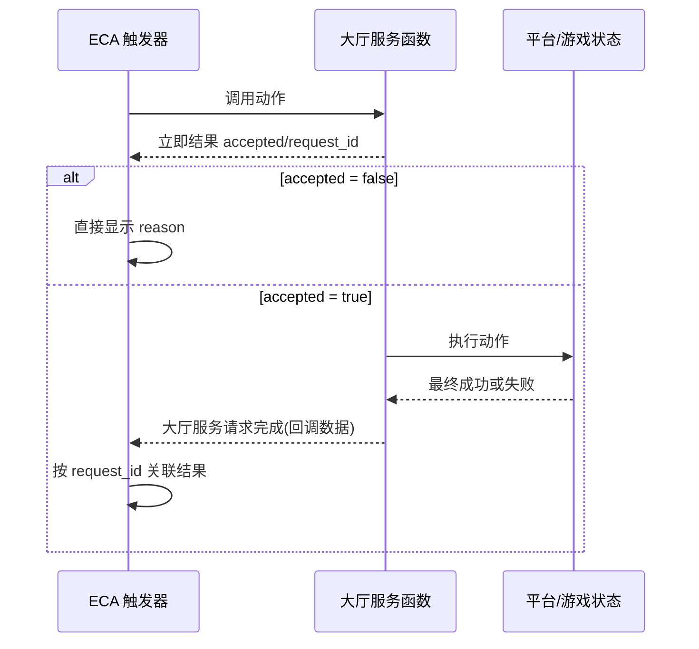

# ECA 功能使用

[返回文档入口](./README.md)

本章面向已经能在 Y3 中创建 ECA 触发器、调用函数和监听自定义事件的开发者。你只需要使用名称以 `大厅服务 - ` 开头的正式函数，不需要理解 `BOB`、客户端连接或网络协议实现。

## 接入前提

完整 ECA 路径需要：

1. 当前地图加载 `pub.core.bob`、`pub.pub` 和 `pub.eca_lobby_api`。
2. 21 个正式函数已经生成到使用它们的地图，并与 `tools/eca/lobby_service_functions.json` 一致。
3. 主关卡存在自定义事件 `大厅服务请求完成`，参数 `回调数据` 的类型为字典/TABLE。
4. 子关卡继承主关卡事件配置，不重复手写事件编号。
5. 目标项目已替换完整迁移所需的玩法、地图、关卡、模式、人数和环境参数。

当前项目的事件编号是实现细节。迁移时必须让编辑器在目标项目创建并保存事件，不要复制当前编号。

## 两阶段调用模型

多数正式函数是动作。调用动作时会先立即返回一个 TABLE，说明本地对外调用接口是否受理；受理后，再由 `大厅服务请求完成` 事件给出最终结果。



### 立即返回字段

| 字段 | 类型 | 含义 |
| --- | --- | --- |
| `accepted` | boolean | `true` 表示请求已受理，后续会有一次完成事件 |
| `reason` | string | 受理说明或本地拒绝原因 |
| `request_id` | string | 已受理请求的唯一编号；拒绝时为空字符串 |
| `action` | string | 动作名称 |
| `sync` | boolean | 动作受理结果为 `false`；本地拒绝结果为 `true` |
| `result_data` | TABLE | 立即补充数据，动作受理时通常为空 |

拒绝结果不会触发完成事件。不要在 `accepted = false` 时继续等待。

### 完成事件字段

`大厅服务请求完成` 的参数 `回调数据` 包含：

| 字段 | 类型 | 含义 |
| --- | --- | --- |
| `request_id` | string | 与立即返回中的编号一致 |
| `action` | string | 动作名称 |
| `success` | boolean | 最终是否成功 |
| `reason` | string | 最终结果或失败原因 |
| `result_data` | TABLE | 动作产生的数据 |

已受理请求只应产生一次完成事件。推荐在 ECA 中保存“当前请求编号”，事件到达时先比较 `request_id`，再更新对应按钮、提示或状态。

## 同步查询与异步状态快照

下列三个查询同步返回业务数据，不创建 `request_id`，也不触发完成事件：

- `大厅服务 - 获取队伍成员`
- `大厅服务 - 获取聊天记录`
- `大厅服务 - 获取副本口令`

`大厅服务 - 获取状态快照` 不是同步查询。它是请求式异步动作：立即返回受理结果，随后通过 `大厅服务请求完成` 返回状态数据。H 键测试同样会先打印立即结果，再由监听器打印完成事件。

## 21 个正式函数

函数名以 ECA DSL 为准。本文首次使用完整正式名；表格后的短称只用于叙述，不代表另一个函数。
21 个正式函数均返回 ECA `TABLE`。动作函数返回受理结构，查询函数返回对应业务数据；参数名称、类型和是否可选以本节表格为准。

### 连接、队伍与匹配动作

| 正式函数 | 参数 | 前置条件与结果 |
| --- | --- | --- |
| `大厅服务 - 重建大厅连接` | 无 | 重新创建连接；完成事件返回 `aid` |
| `大厅服务 - 设置匹配分数` | `分数: integer` | 连接就绪；刷新玩家信息后完成 |
| `大厅服务 - 创建队伍` | 无 | 连接就绪且当前不在队伍中 |
| `大厅服务 - 加入队伍` | `队伍编号: integer` | 有效正整数，且未在匹配/启动中 |
| `大厅服务 - 离开队伍` | 无 | 当前在队伍中 |
| `大厅服务 - 解散队伍` | 无 | 当前是队长 |
| `大厅服务 - 转移队长` | `目标AID: integer` | 当前是队长，目标在队伍中且不是自己 |
| `大厅服务 - 移出队员` | `目标AID: integer` | 当前是队长，目标在队伍中且不是自己 |
| `大厅服务 - 开始匹配` | `分数: integer?` | 连接和队伍状态允许匹配；分数可省略 |
| `大厅服务 - 取消匹配` | 无 | 当前正在匹配；组队时由队长取消 |

### 副本、退出与聊天动作

| 正式函数 | 参数 | 前置条件与结果 |
| --- | --- | --- |
| `大厅服务 - 创建私人副本` | 无 | 当前在大厅；平台受理后跨图 |
| `大厅服务 - 启动多人私人副本` | 无 | 完整 `BOB`、队长、队伍人数足够 |
| `大厅服务 - 加入口令副本` | `副本口令: string` | 当前在大厅，口令非空；平台受理后跨图 |
| `大厅服务 - 返回大厅` | 无 | 创建大厅实例并跨图 |
| `大厅服务 - 退出游戏` | 无 | 完成退出前清理并在完成事件后退出 |
| `大厅服务 - 发送队伍聊天` | `消息: string` | 连接就绪、消息非空、当前在队伍中 |
| `大厅服务 - 发送世界聊天` | `消息: string` | 连接就绪、消息非空 |

### 查询函数

| 正式函数 | 返回方式 | `result_data` 或同步字段 |
| --- | --- | --- |
| `大厅服务 - 获取状态快照` | 请求式异步 | 模式、连接、队伍、匹配、副本和事件摘要 |
| `大厅服务 - 获取队伍成员` | 同步 | `count`、`members_json`、最多 8 个展开成员 |
| `大厅服务 - 获取聊天记录` | 同步 | `count`、`chat_json`、最近 5 条展开记录 |
| `大厅服务 - 获取副本口令` | 同步 | `dungeon_token` |

## 状态快照字段

`大厅服务 - 获取状态快照` 完成事件的 `result_data` 包含：

| 字段 | 含义 |
| --- | --- |
| `mode_id`、`mode_label` | 当前模式编号和可读名称 |
| `is_battle_context` | 是否处于匹配对局或私人副本上下文 |
| `bob_exists`、`bob_ready` | 连接对象是否存在、是否就绪 |
| `aid` | 当前玩家的服务身份 |
| `team_id` | 当前队伍编号；无队伍时为 0 |
| `member_count`、`member_limit` | 当前人数与人数上限 |
| `is_captain` | 当前玩家是否为队长 |
| `matching`、`launching` | 是否匹配中、是否启动中 |
| `dungeon_token` | 当前私人副本口令；无口令时为空字符串 |
| `result_event_id`、`result_event_name` | 实际使用的完成事件信息 |

## 队伍成员查询字段

`大厅服务 - 获取队伍成员` 同步返回：

- `count`：成员数量。
- `members_json`：完整成员数组的 JSON 字符串。
- `item_N_aid`、`item_N_name`、`item_N_state`、`item_N_score`、`item_N_is_captain`：最多展开 8 名成员。

ECA 面板只需要固定槽位时使用展开字段；需要遍历完整数据时使用 `members_json` 并在自己的数据层解析。

## 聊天记录查询字段

`大厅服务 - 获取聊天记录` 同步返回：

- `count`、`chat_json`。
- 最近 5 条 `item_N_message`、`item_N_time`、`item_N_channel`、`item_N_sender_aid`、`item_N_sender_name`。

## 典型 ECA 操作路径

### 建立大厅连接

1. 调用 `大厅服务 - 重建大厅连接`。
2. 判断返回 TABLE 的 `accepted`。
3. 被拒绝时显示 `reason`。
4. 已受理时保存 `request_id`，临时禁用依赖连接的按钮。
5. 在 `大厅服务请求完成` 中匹配编号；`success = true` 后启用队伍、匹配和聊天入口。

### 创建队伍并开始匹配

1. 调用 `大厅服务 - 创建队伍` 并等待完成。
2. 需要调整分数时调用 `大厅服务 - 设置匹配分数` 并等待完成。
3. 调用 `大厅服务 - 开始匹配`。
4. 匹配请求完成后继续通过状态快照或界面状态显示排队状态。
5. 匹配成功触发跨图后，在目标地图重新查询状态。

不要在开始匹配的完成事件到跨图结束之间重新开放开始按钮。

### 创建私人副本并口令加入

客户端 A：

1. 在大厅调用 `大厅服务 - 创建私人副本`。
2. 收到成功完成事件时，只能确认平台已受理。
3. 进入副本地图后调用同步函数 `大厅服务 - 获取副本口令`。
4. 将非空 `dungeon_token` 分享给客户端 B。

客户端 B：

1. 在大厅调用 `大厅服务 - 加入口令副本`，传入口令。
2. 处理立即拒绝或完成事件。
3. 进入副本地图后调用 `大厅服务 - 获取状态快照`，等待完成事件确认模式和副本状态。

任一客户端返回大厅：

1. 调用 `大厅服务 - 返回大厅`。
2. 平台受理后等待跨图。
3. 进入大厅后再次调用 `大厅服务 - 获取状态快照`。

## 跨图降级语义

创建私人副本、口令加入和返回大厅的成功完成事件会包含：

```lua
local result_data = {
    cross_map_tracking = 'degraded',
}
```

`degraded` 表示当前 Lua 运行环境无法跨地图继续持有请求。完成事件只证明平台已受理切图请求，不证明客户端已经进入目标地图。

正确做法是在目标地图重新加载 ECA/Lua 入口，并重新调用 `大厅服务 - 获取状态快照` 或同步口令查询。

## 并发、超时与按钮状态

- 队伍、匹配、副本切换和退出动作共享一个操作锁；已有操作处理时，新操作会立即拒绝。
- 聊天使用独立锁，并按请求串行处理。
- 已受理请求默认 10 秒超时。超时会产生失败完成事件。
- 本地拒绝没有完成事件；已受理请求即使失败也应收到一次完成事件。
- UI 应以 `accepted` 控制是否进入等待态，以匹配的完成事件退出等待态。

## 自定义事件配置

只在主关卡创建 `大厅服务请求完成`，并添加字典参数 `回调数据`。保存后刷新 Lua 元数据，确认目标项目生成了事件名称映射。

子关卡使用主关卡的事件配置。不要复制当前项目的事件编号或手改工程 JSON；目标项目的编号由编辑器生成。

## 完整路径与轻量路径的区别

当前 21 个正式函数是完整 `BOB` 的 ECA 适配层。队伍、匹配、聊天、多人私人副本、退出清理和多数状态字段都依赖完整核心。

如果目标项目只迁移引擎私人副本，不要复制包含 21 个函数的完整对外调用接口。应按 [轻量私人副本迁移](./05-轻量私人副本迁移.md) 创建只覆盖创建、取口令、口令加入、返回大厅和跨图后查询的轻量 ECA 对外调用接口。

## 失败定位

| 立即 `accepted = false` 的原因 | 处理 |
| --- | --- |
| 大厅连接尚未创建/就绪 | 先重建连接并等待完成 |
| 参数不是有效整数或字符串为空 | 修正 ECA 输入变量 |
| 已在队伍、未在队伍或不是队长 | 先查询成员和状态，再更新按钮可用性 |
| 匹配或启动中不能操作 | 等待当前操作结束或取消匹配 |
| 当前已在副本中 | 不要再次创建或口令加入；改用返回大厅 |
| 正在退出游戏 | 禁用所有新动作，等待退出完成 |

| `accepted = true` 但最终失败 | 处理 |
| --- | --- |
| 10 秒超时 | 检查平台服务、身份、网络环境和状态通知 |
| 客户端需要更新 | 使用与服务端兼容的客户端版本 |
| 匹配服务不可用 | 检查当前环境和服务可用性 |
| 口令/容量/补人时间被平台拒绝 | 使用有效口令并在允许时间内重试 |
| 完成事件收不到 | 检查主关卡事件名、参数名和元数据继承 |

完整测试步骤见 [验证与故障排查](./06-验证与故障排查.md)。
