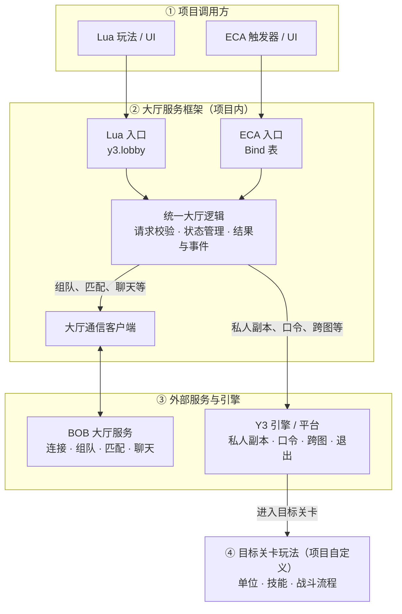

# 项目概览

[返回文档首页](./README.md)

## 系统能力

大厅服务框架提供这些游戏内能力：

- 建立大厅服务连接，并查询连接状态。
- 创建队伍、加入队伍、离开队伍、解散队伍、转移队长、移出队员、查询队伍成员。
- 设置匹配分数、开始匹配、取消匹配。
- 发送队伍聊天、发送世界聊天、获取聊天记录。
- 局内私人副本：无队伍或一人队伍时创建单人私人副本；多人队伍时由队长带全量队伍成员进入目标关卡。
- 加入口令、获取口令。
- 返回大厅、退出游戏。
- 获取状态快照、状态变化事件、单个队伍成员、单条聊天消息、队伍信息和玩家信息，便于 UI 或 ECA 触发器判断当前状态。

Lua 作者使用 `y3.lobby` 对外调用接口。ECA 作者通过 `Bind` 表调用“大厅服务 - ...”对外调用接口。两种方式调用同一套框架，不需要维护两份大厅代码。

本文所说的“平台地图 ID”，就是地图上传到平台后获得的正整数地图编号。Lua 接口中的参数名仍为 `game_play_id`，ECA 的现有参数名仍显示为“玩法ID”，二者都应填写这个平台地图 ID。它不同于关卡 ID、地图版本 UUID 和地图模式 ID。

## 项目架构

从上往下阅读即可：项目代码通过 Lua 或 ECA 入口调用同一套大厅逻辑，大厅逻辑再根据功能类型选择 BOB 大厅服务或 Y3 引擎能力。

需要注意：

- Lua 与 ECA 只是入口不同，最终执行的是同一套大厅逻辑。
- 连接、组队、匹配和聊天等联网能力由 BOB 大厅服务处理。
- 私人副本、口令、跨图和退出等能力由 Y3 引擎或平台处理。
- `service_pb.lua`、`protocol.pb` 和各 JSON 配置为上述流程提供协议与规则，不是调用方需要直接操作的业务层。
- 进入目标关卡后，大厅框架的职责结束；单位、技能和战斗流程由项目自行实现。

## 主要文件

迁移后主要关注这些文件：

| 文件 | 作用 |
| --- | --- |
| `script/y3/init.lua` | 加载 `y3`，并让 `y3.lobby` 可用 |
| `script/y3/game/lobby/init.lua` | Lua 对外调用接口 |
| `script/y3/game/lobby/eca.lua` | 注册 ECA 对外调用接口 |
| `script/y3/game/lobby/proto/service_pb.lua` | 框架自带的内嵌服务协议，运行时由 Lua 直接加载 |
| `custom/protocol/protocol.pb` | 项目协议资源，由项目维护 |
| `gamemode.json` | 配置项目有哪些模式 |
| `match.json` | 配置匹配规则和匹配目标关卡 |
| `dungeon.json` | 配置每个关卡支持的模式、人数和中途加入时间 |
| `setting.json` | 项目基础设置；迁移大厅框架时通常不覆盖 |

`tools/eca/lobby_service_functions.json` 和 `tools/eca/lobby_service_tests.json` 只用于当前项目测试，不是用户迁移文件。

## 运行流程

1. 地图启动时加载 `y3`。
2. 玩家进入大厅后调用 `y3.lobby.connect(平台地图ID)`，或通过 ECA 执行“大厅服务 - 建立连接”，将平台地图 ID 填入“玩法ID”参数。平台地图 ID 必填；如果是在目标游戏关卡内建立连接，可额外传入“是否在游戏关卡”。
3. 等待连接完成后，再调用组队、匹配、聊天、高级查询和有队伍的局内私人副本等需要大厅连接的对外调用接口。
4. 无队伍的局内私人副本、加入口令、获取口令、返回大厅和退出游戏不要求预先连接 BOB，可在需要时直接调用。
5. 返回大厅只提交跨图请求并保留大厅服务中的队伍、匹配和 BOB；退出游戏才会执行清理。回到大厅后重新建立连接并查询原状态。

局内私人副本只负责让合格玩家进入指定关卡，不负责进入关卡后的战斗单位创建、技能发放或玩法开始逻辑。

[下一篇：迁移](./02-迁移.md)
